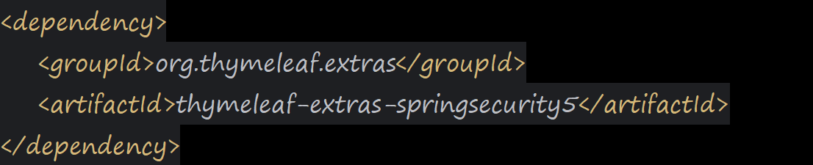
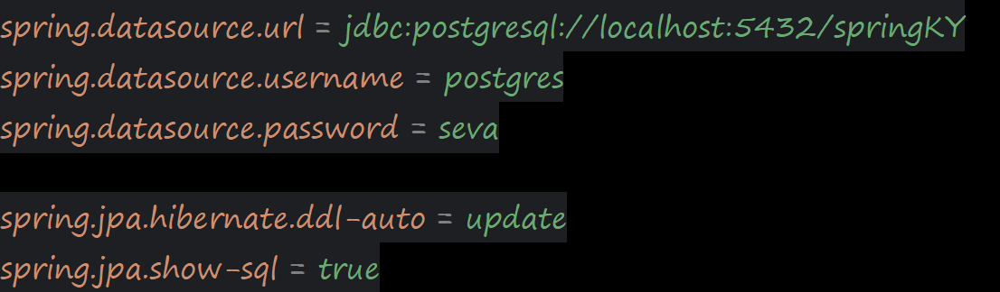

Авторизация и регистрация с использованием фреймворка Spring Security

ЗАВИСИМОСТИ
-Для подключения к БД PostgreSQL

-Зависимость,которая позволяет использовать теги безопасности для HTML страниц

-Зависимость, которая по умолчанию связана с 
зависимостями jacson, spring-core, spring-mvs, tomcat

-Библиотка для сокращения кода в классах и расширения функциональности
языка Java

-Реализация репозиториев JPA для простого добавления уровня 
доступа к данным в приложении

-Пакет,который позволяет включить в приложение возможность Bean Validator.
Работает путем определения ограничений для полей в классе с помощью аннотаций.

-JUnit-фреймворк для автоматического юнит -тестирования.

-JetBrains.Annotation - пакет содержит атрибуты,предназначенные для предоставления подсказок
продуктам разработанным JetBrains.

НАСТРОЙКА СВОЙСТВ Spring Datasource, JPA
-Для PostgreSQL

Настройка Spring Security

Настройка почты

Порт приложения

ЗАПУСК ПРИЛОЖЕНИЯ
spring-boot:run

ВЫПОЛНИТЕ ИНСТРУКЦИИ ДЛЯ БД
Создайте БД
Запустите приложение 
Выполните запрос по вставке в таблицу пользователя с ролью АДМИН

